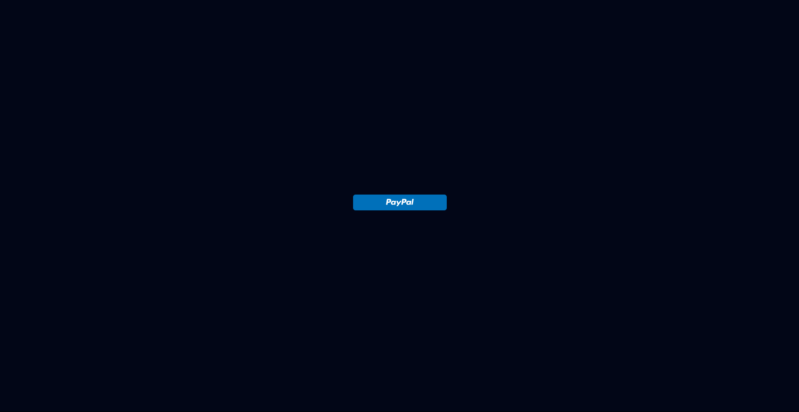
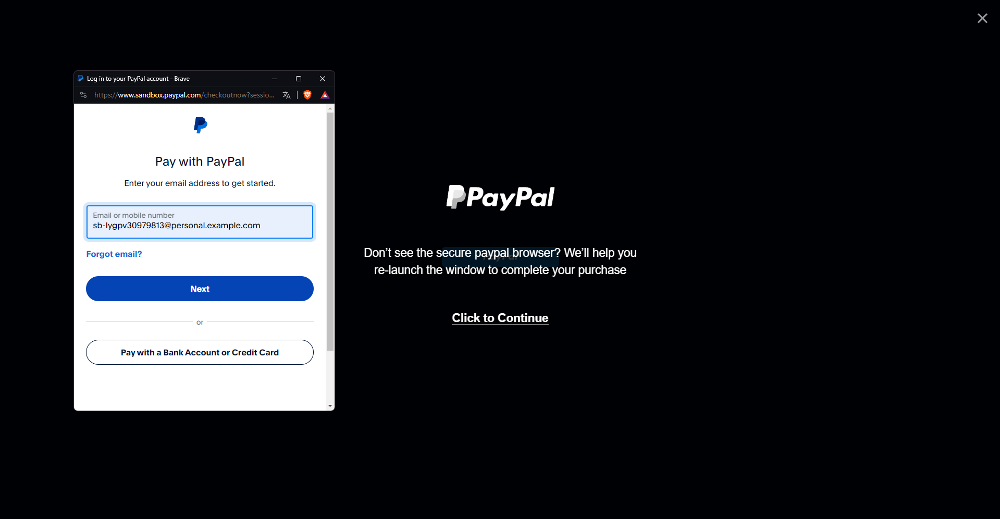

## Getting Started

Es un proyecto donde intrego la pasarela de pago paypal en un  proyecto,
primero se necesita el crear una cuenta en paypal developer, generar una empresa (para pruebas) y un correo como la imagen (de pruebas) para poder hacer los pagos correspondientes.




Primero:

```bash
npm install
```

para levantar el proyecto en el ruta <http://localhost:3000>

```bash
npm run dev
# or
yarn dev
# or
pnpm dev
# or
bun dev
```
